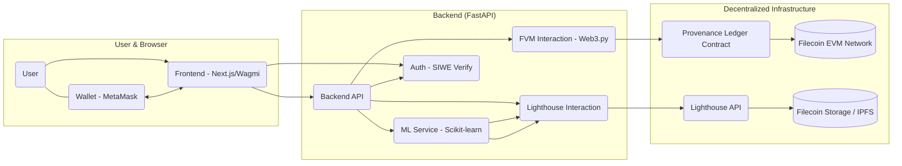

# VeriFAI: Decentralized AI Platform with Filecoin & FVM Provenance

[](https://opensource.org/licenses/MIT) <!-- Optional: Add a license badge -->

**Build trust and reproducibility in your AI workflows using decentralized storage and immutable on-chain provenance.**

**Hackathon Submission for:** Filecoin - Hack the data layer for AI

---

**Quick Links:**
*   [Live Demo](#live-demo) <!-- Update with actual link -->
*   [Video Demo](#video-demo) <!-- Update with actual link -->
*   [Slide Deck](#presentation) <!-- Update with actual link -->

---

## Problem

Traditional AI development faces significant challenges:

1.  **Data & Model Persistence:** Datasets and trained models stored on centralized cloud services are subject to platform risk, censorship, and recurring costs (renting storage). Valuable assets can be lost or become inaccessible.
2.  **Lack of Trust & Reproducibility:** It's difficult to verify the exact dataset used for training a specific model or trace the lineage of AI assets, leading to trust issues and hindering reproducibility.
3.  **Centralized Control:** Users lack true ownership and control over their AI assets stored in centralized silos.

## Solution: VeriFAI

VeriFAI is a web platform that empowers users to manage their machine learning workflows with enhanced trust, persistence, and verifiability by leveraging the Filecoin ecosystem:

*   **Decentralized Storage:** Utilizes **Lighthouse Storage** (built on Filecoin & IPFS) to store ML datasets and models permanently. Pay once, store forever, with content-addressing ensuring data integrity.
*   **Immutable Provenance:** Records key metadata (dataset CID, model CID, metadata CID, owner address, timestamp) as an immutable record on a **Filecoin Virtual Machine (FVM) smart contract**, creating a verifiable audit trail.
*   **Web3 Authentication:** Uses **Sign-In with Ethereum (SIWE)** for secure, wallet-based user authentication.



## Key Features (Implemented)

*   **(F1) Wallet Authentication:** Secure login using MetaMask (or other wallets) via SIWE standard.
*   **(F2) Decentralized Dataset Upload:** Upload datasets (e.g., CSV) directly to Lighthouse/Filecoin via the UI.
*   **(F3) Backend Model Training:** Trigger model training (Scikit-learn RandomForest) on uploaded datasets via API. *(Status reporting via API endpoint)*.
*   **(F4) Decentralized Model Upload:** Automatically store trained models (.joblib) and metadata (.json) on Lighthouse/Filecoin.
*   **(F5) On-Chain Provenance Registration:** Automatically register an immutable `AssetRecord` on the FVM smart contract linking the dataset, model, metadata CIDs, and owner address upon successful training.
*   **(F6) Model Inference:** Perform predictions using trained models loaded directly from Filecoin/IPFS via their CIDs.
*   **(F7) On-Chain Provenance Viewing:** Query and display the immutable provenance records associated with assets or owners directly from the FVM via the UI.

## Filecoin Challenge Integration: Hacking the AI Data Layer

VeriFAI directly addresses the Filecoin challenge by fundamentally changing how AI assets are managed:

1.  **Persistent & Verifiable Storage (Lighthouse/Filecoin):** We replace ephemeral, rented cloud storage with permanent, content-addressed storage on the Filecoin network via Lighthouse. This ensures AI datasets and models are durable, resilient, and their integrity can always be verified via their CIDs.
2.  **Tamper-Proof Provenance (FVM):** We utilize the Filecoin Virtual Machine (FVM) to create an immutable, on-chain registry. Our smart contract links datasets CIDs to the resulting model CIDs and metadata CIDs, alongside owner addresses and timestamps. This provides an undeniable, publicly verifiable record of asset lineage, crucial for AI safety, auditing, and reproducibility.
3.  **Decentralized Control:** By using decentralized storage and wallet-based authentication, users retain greater control and ownership over their AI assets, moving away from centralized platform lock-in.

This combination "hacks" the traditional AI data layer by introducing cryptographic guarantees for persistence, integrity, and provenance directly into the workflow.

## Tech Stack

*   **Frontend:** NextJS, Wagmi, Viem, Tailwind CSS, Shadcn
*   **Backend:** Python 3.9+, FastAPI, Uvicorn, Lighthouse-Web3 SDK, Scikit-learn, Pandas, Joblib, Web3.py, SIWE library
*   **Blockchain:** Solidity, Filecoin Virtual Machine (FVM) - *Deployed on Calibration Testnet*
*   **Smart Contract Dev:** Hardhat / Foundry *(Specify which one you used)*
*   **Storage Layer:** Lighthouse Storage (Filecoin/IPFS)

## Monorepo Structure

*   `frontend/`: Contains the NextJS frontend application. ([README](frontend/README.md))
*   `backend/`: Contains the Python FastAPI backend service and ML logic. ([README](backend/README.md))
*   `contracts/`: Contains the Solidity smart contract for FVM. ([README](contracts/README.md))

## Setup & Running

*(Combine and refine instructions from backend/frontend READMEs)*

**Prerequisites:**

*   Node.js (v18+) & npm/yarn
*   Python 3.9+ & pip
*   MetaMask browser extension (or other wallet) configured for Filecoin Calibration testnet.
*   Test FIL on Calibration testnet for the *backend wallet* (for gas fees).
*   Lighthouse API Key ([Get one here](https://files.lighthouse.storage/dashboard))

**1. Clone Repository:**
   ```bash
   git clone <your-repo-url>
   ```

**2. Backend Setup:**
   ```bash
   cd backend
   python -m venv venv
   source venv/bin/activate  # or .\venv\Scripts\activate (Windows)
   pip install -r requirements.txt
   # Create and configure .env file (see backend/README.md for details)
   # **Crucially, set:** LIGHTHOUSE_API_KEY, FVM_RPC_URL, BACKEND_WALLET_PRIVATE_KEY, CONTRACT_ADDRESS, JWT_SECRET_KEY
   cd ..
   ```

**3. Frontend Setup:**
   ```bash
   cd frontend
   pnpm install # or yarn install
   ```

**4. Deploy Smart Contract:**
   ```bash
   cd contracts
   forge install
   forge compile
   forge script script/DeployProvenanceLedger.s.sol:DeployProvenanceLedger --rpc-url https://rpc.ankr.com/filecoin_testnet --broadcast --skip-simulation
   ```

**5. Run the Application:**
   *   **Terminal 1 (Project Root):** Run Backend
      ```bash
      cd backend && source venv/bin/activate && cd .. # Ensure venv active
      uvicorn backend.main:app --host 0.0.0.0 --port 8000 --reload
      ```
   *   **Terminal 2 (Project Root):** Run Frontend
      ```bash
      cd frontend
      pnpm run dev # or yarn dev
      ```
   *   Access the frontend at `http://localhost:3000` (or the specified port).

## Live Demo

*   **Link:** [Your Deployed Frontend URL] *(e.g., Vercel, Netlify, Render)*
*   **Note:** Requires MetaMask connected to Filecoin Calibration Testnet.

## Video Demo

*   **Link:** [https://www.loom.com/share/49c902b61b2f44edb44da1fefd3413af?sid=94f2c838-f1f7-4a94-a4a3-6f8fc1fc2e83]

## Presentation

*   **Link:** [Your Google Slides/Canva/PDF Deck URL]

## Future Improvements

*   Support for different ML frameworks/models.
*   Integration with decentralized compute networks (e.g., Bacalhau).
*   More granular access control for assets.
*   Production-ready background task queue and job store.
*   Dataset/Model versioning.
 